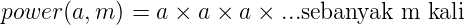
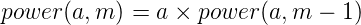
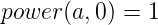

# _Variable Scope_, Fungsi dan Rekursi

## Daftar Isi

- [Fungsi](#fungsi)
    + [Pengenalan Fungsi](#pengenalan-fungsi)
    + [Tujuan Fungsi](#tujuan-fungsi)
    + [Pendefinisan Fungsi](#pendefinisian-fungsi)
    + [Prototipe Fungsi](#prototipe-fungsi)
    + [Parameter Fungsi](#parameter-fungsi)
    + [Pemanggilan Fungsi](#pemanggilan-fungsi)
    + [Nilai _return_ Fungsi](#nilai-return-fungsi)
- [Variable Scope](#variable-scope)
    + [Variabel Lokal](#variabel-lokal)
    + [Variabel Global](#variabel-global)
- [Fungsi Rekursif](#fungsi-rekursif)
    + [Pengenalan Fungsi Rekursif](#pengenalan-fungsi-rekursif)
    + [Recursive Case dan Base Case](#recursive-case-dan-base-case)
- [Soal Latihan](#soal-latihan)

# Fungsi

## Pengenalan Fungsi

**Fungsi** adalah sebuah kumpulan statement untuk melakukan tugas spesifik (tugas tertentu), yang bisa membutuhkan input ataupun tidak, untuk menghasilkan output yang sesuai.

Secara umum, fungsi dibedakan menjadi dua, yakni Fungsi Standar Library dan Fungsi yang dibuat pengguna. Fungsi Standar Library adalah fungsi bawaan yang telah disertakan dalam library standar, missal fungsi `printf()`, `scanf()` yang ada di dalam library `<stdio.h>`. Sedangkan Fungsi yang dibuat oleh pengguna adalah fungsi yang sengaja dibuat oleh pengguna.

## Tujuan Fungsi

Tujuan dibuatnya fungsi secara umum adalah untuk membuat program menjadi lebih modular. Fungsi digunakan ketika ingin menjalankan serangkaian perintah secara berulang kali, terkadang dengan input yang berbeda, dengan tujuan tidak mengulang penulisan kode berkali-kali, serta apabila nantinya program mengalami bug, akan mempermudah proses perbaikan.

## Pendefinisian Fungsi

Sebelum fungsi dapat digunakan dan bisa dipanggil, perlu dilakukan pendefinisan terlebih dahulu. Pendefinisian ditujukan untuk mendefinisikan apa yang fungsi tersebut lakukan ketika fungsi tersebut dipanggil. Berikut adalah sintaks untuk melakukan pendefinisan fungsi.

```
<return_type> <nama_fungsi>(<parameter1>, <parameter2>, ...)
{
    statement;
    statement;
    ...
    ...
    ...
}
```
Berikut adalah contoh fungsi untuk mencetak string **"Aku Sebuah Fungsi."**.
```c
void cetak()
{
    printf("Aku Sebuah Fungsi\n");
}

int main()
{
    cetak();
    return 0;
}
```

## Prototipe Fungsi

Selain menggunakan pendefisian langsung seperti cara sebelumnya, fungsi juga dapat dibuat dengan prototipe. Prototipe Fungsi (atau biasa disebut Interface Fungsi) adalah deklarasi dari sebuah fungsi tanpa definisinya. Deklarasi sebuah fungsi berisi _return type_, nama fungsi, dan parameter yang terlibat.

Untuk menuliskan prototipe fungsi, sintaksnya sebagai berikut :
```
// Deklarasi
<return_type> <nama_fungsi>(<parameter1>, <parameter2>, ...);
```

Contoh kode program menggunakan prototipe fungsi.
```c
// Prototipe Fungsi
void cetak();

int main()
{
    cetak();
    return 0;
}

// Definisi Fungsi cetak()
void cetak()
{
    printf("Aku Sebuah Fungsi\n");
}
```

## Parameter Fungsi

Parameter pada fungsi bersifat layaknya input yang diberikan kepada sebuah fungsi. Jumlah parameter pada sebuah fungsi bisa dibuat sebanyak-banyaknya sesuai kebutuhan.

Penulisan parameter fungsi sama dengan pendefinisian variable dan tiap parameter dipisahkan oleh operator (`,`).

```
<tipe_data> <nama_parameter_1> , <tipe_data> <nama_parameter_2>, ...
```
Contoh
```c
void cetak(char str[])
{
    printf("%s\n", str);
}

void jumlah(int a, int b)
{
    int hasil = a + b;
    printf("%d\n", hasil);
}
```

### Array Sebagai Parameter

Selain variabel, array juga bisa dijadikan sebagai parameter fungsi dengan menambahkan kurung `[]`.
```c
void maksimumDari(int arr[])
{
    // statement
}

int main()
{
    int number[5] = {1, 2, 3, 4, 5};
    
    // Pemanggilan Fungsi
    maksimumDari(number);
}
```
> Perilaku array apabila dijadikan parameter fungsi berbeda dengan variabel. Akan dijelaskan pada modul berikutnya.

## Pemanggilan Fungsi

Untuk memanggil fungsi, dilakukan dengan menulis nama fungsinya diikuti dengan tanda “`()`”. Pabila fungsi tersebut memiliki parameter maka didalam tanda “`()`” dituliskan nilai/variabel/objek untuk dijadikan yang kita sebut dengan argumen dan dipisahkan tiap argumen dengan operator “`,`”. Argumen-argumen yang dimasukkan harus sesuai dengan tipe data parameter fungsinya.

Contoh pemanggilan fungsi.

```c
int main()
{
    cetak();
    tambahkan(2,5);
    cetak("Halo, dunia");
}
```

## Nilai _return_ Fungsi

Jika kita menginginkan fungsi yang kita jalankan menghasilkan sebuah nilai atau sederhananya menghasilkan sebuah output,  kita bisa menambahkan keyword `return` dan medefinisikan _return type_ dari fungsi tersebut. Fungsi yang memiliki _return type_ bukan void pasti memiliki _return value_. Nilai yang dikembalikan oleh fungsi tersebut memiliki tipe data yang bersesuaian dengan return type-nya.

Saat menemui statement `return` pada fungsi, maka fungsi tersebut akan berhenti dari titik dimana `return` tersebut dieksekusi, kemudian kembali ke bagian kode yang memanggil fungsi tersebut.

Misal kita ingin mendapatkan hasil dari penjumlahan dua bilangan menggunakan fungsi bernama `jumlah()`.

```c
#include <stdio.h>

int jumlah(int a, int b);

int main()
{
    int x = 2, y = 3, hasil;
    hasil = jumlah(x, y);
    printf("%d\n", hasil);
    return 0;
}

int jumlah(int a, int b)
{
    int hasil = a;
    hasil += b;
    return hasil;
}
```
Coba jalankan program di atas, dan lihat outputnya. Kemudian bandingkan dengan program di bawah, `return` diletakkan sebelum penjumlahan.
```c
#include <stdio.h>

int jumlah(int a, int b);

int main()
{
    int x = 2, y = 3, hasil;
    hasil = jumlah(x, y);
    printf("%d\n", hasil);
    return 0;
}

int jumlah(int a, int b)
{
    int hasil = a;
    return hasil; //return here
    hasil += b;
    return hasil;
}
```

# _Variable Scope_

## Variabel Lokal

Sebuah variabel yang berada/didefinisikan di dalam sebuah blok adalah variabel lokal. Variabel yang sifatnya lokal hanya dapat diakses pada blok tersebut saja. Misalnya :

```c
int main()
{
    int a = 0;
    while (a <= 100) {
        // variabel x hanya dapat dibaca pada blok while saja
        int x;
        x = a + a;
        a++;
    }

    // Error, x tidak diketahui
    x = 2;

    // Variabel a masih terdapat pada blok yang sama
    a = 2;

    return 0;
}
```
Contoh lain
```c
int jumlah(int a, int b)
{
    // variabel hasil bersifat lokal terhadap fungsi jumlah()
    int hasil = a + b;
    return hasil;
}

int main()
{
    // variabel hasil di fungsi main() 
    // adalah variabel yang berbeda 
    // dengan hasil di fungsi jumlah()
    int hasil;
    // ...
    // ...
    // ...
}
```

## Variabel Global

Variabel global adalah varibel yang dideklarasikan diluar fungsi (secara global) dan dapat diakses dari semua fungsi. Misalnya :
```c
// variabel iniGlobal merupakan variabel global
int iniGlobal;

void fungsi()
{
    // ..
    // dapat mengakses iniGlobal
}

int main()
{
    // ..
    // dapat mengakses iniGlobal
}
```

# Fungsi Rekursif

## Pengenalan Rekursi

Rekursi merujuk kepada definisi suatu hal yang dilakukan secara berulang-ulang.


Gambar diatas juga merupakan salah satu representasi definisi dari rekursi. Didalam dunia pemrograman istilah rekursi digunakan untuk menggambarkan fungsi yang bersifat rekursif.

Fungsi yang bersifat rekursif adalah fungsi yang memanggil dirinya sendiri didalam fungsi tersebut.

Perhatikan contoh program di bawah.

```c
#include <stdio.h>

void rekursi(int n)
{
    printf("%d\n", n);
    rekursi(n+1);
}

int main()
{
    rekursi(1);
    return 0;
}
```
Fungsi `rekursi()` merupakan fungsi yang bersifat **rekusif** karena didalamnya memanggil fungsi `rekursi()` itu sendiri.

Apa yang terjadi ketika program tersebut dijalankan.

## Recursive Case dan Base Case

Program sebelumnya akan terus mencetak tanpa henti karena fungsi tersebut tidak tahu kapan dirinya harus berhenti untuk memanggil dirinya sendiri. Karena dari itu kita perlu **base case** pada sebuah fungsi rekursif.

Base Case adalah sebuah kasus atau kondisi yang kita berikan kepada sebuah fungsi rekursif untuk berhenti memanggil dirinya lagi atau disebut juga _terminating condition_.

Recursive Case adalah kasus dimana sebuah fungsi diharuskan untuk memanggil dirinya sendiri, dalam kata lain sebuah fungsi tersebut belum mencapai base casenya.

Kita ambil contoh fungsi rekursif untuk memangkatkan suatu bilangan bulat. Didefinisikan perpangkatan sebuah bilangan a pangkat m sebagai **power(a, m)**, berarti dapat dituliskan :



atau dapat didefinisikan sebagai fungsi rekursif



dengan base case-nya adalah :



Dapat diperhatikan bahwa base case dari fungsi **power(a, m)** adalah ketika power(a, 0) yang menghasilkan 1. Ketika sudah mencapai base case, maka tidak perlu melakukan pemanggilan fungsi lagi.

```c
#include <stdio.h>

int power(int a, int m)
{
    if (m == 0) return 1;       // base case
    return (a * power(a, m-1)); // recursive case
}

int main()
{
    printf("%d\n", power(2,3));
    return 0;
}
```
# Soal Latihan

## Soal 1

Buatlah program dan **implementasikan fungsi rekursif** untuk menentukan nilai dari N! (faktorial).

**Contoh Input**

```
5
```

**Contoh Output**

```
120
```
## Soal 2

Diberikan sebuah pola bilangan dengan polanya adalah 1, 5, 14, 30, ... dst. Buatlah sebuah program dan **implementasikan fungsi rekursif** untuk menentukan bilangan ke-n dari pola tersebut.

**Contoh Input**

```
2
```
**Contoh Output**

```
5
```

## Soal 3

Buatlah program dan **implementasikan fungsi** untuk menentukan bilangan terbesar dan terkecil dari array A dengan N bilangan.

**Contoh Input**

```
5 
1 2 3 4 5
```

**Contoh Output**

```
max: 5
min: 1
```
